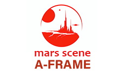

# 🔴 Mars Scene | Una creación en A-Frame

# 🧩 Caracteristicas generales

Bienvenidos a "Mars Scene", un proyecto innovador y educativo diseñado para sumergirte en el fascinante mundo de la realidad virtual mediante la exploración de las capacidades del framework A-Frame.

- Un sitio web meticulosamente diseñado con fines educativos, que ofrece una exploración detallada de las características fundamentales del framework A-Frame. Este recurso es esencial para aquellos interesados en el desarrollo de experiencias inmersivas de realidad virtual a través de plataformas web.
- El proyecto incorpora no solo las entidades básicas de A-Frame, sino que también enriquece su funcionalidad con entidades avanzadas importadas de bibliotecas especializadas como Sketchfab, lo que amplía significativamente sus capacidades y versatilidad.
- Interacciones básicas y fundamentales en el sitio web, diseñadas para proporcionar una comprensión intuitiva y una experiencia de usuario fluida, permitiendo a los visitantes interactuar de manera efectiva con los elementos de realidad virtual presentados.
- El proyecto se destaca por incluir modelos tridimensionales meticulosamente diseñados utilizando Blender, un software avanzado para la creación de gráficos en 3D, lo que demuestra la integración exitosa de herramientas de modelado profesional en el entorno de A-Frame.
- Presenta texturas y ambientes personalizados, cuidadosamente diseñados para mejorar la experiencia inmersiva. Estos elementos son cruciales para crear una atmósfera única y atractiva, que captura la esencia del proyecto y refuerza su impacto visual y sensorial.
- Emplea un motor de físicas sofisticado para demostrar las amplias posibilidades y el potencial de A-Frame en la simulación de entornos realistas y dinámicos, subrayando así la capacidad del framework para crear experiencias de realidad virtual ricas y convincentes.

> "Explorar otros mundos, tocar otros planetas, cruzar el vacío infinito del espacio... Es más que un logro de la ciencia; es un salto profundo en el entendimiento de nuestra propia existencia."
>
>Jackson Foster.

## 🛠️ Herramientas Utilizadas
El stack tecnológico y herramientas utilizadas:

| Herramienta       | Uso                                       |
|-------------------|-------------------------------------------|
| Trello            | Gestión de proyectos y seguimiento de tareas |
| A-Frame           | Framework para desarrollo 3D en la web basado en three.js|
| A-Frame physics system | Motor de fisicas para A-Frame         |
| Photoshop         | Diseño y retoque de imágenes               |
| Blender           | Software gratuito de modelado 3D           |
| Illustrator       | Retoque de imágenes SVG y vectoriales      |
| Midjourney        | IA geenrativa de imagenes (texturas)       |
| Visual Studio Code| Entorno de desarrollo                      |
| Bootstrap         | Framework de CSS para diseño responsivo    |
| HTML5             | Estructura y contenido de la web           |
| CSS3              | Estilos visuales                           |
| JavaScript        | Lógica y funcionalidades de la aplicación  |

## 🔎 Análisis del código en detalle

https://rich-termite-16a.notion.site/Mars-Scene-A-Frame-Explicaci-n-del-c-digo-fd0cbf31d0f4408f9be4192bfac3646f

---

## 📚 Documentación del motor de físicas para A-Frame
https://github.com/c-frame/aframe-physics-system/tree/master  

---

Creado por [JREdesign](https://github.com/JREdesign)  

Proyecto: https://github.com/JREdesign/MarsScene-Aframe

Despliegue: https://jredesign.github.io/MarsScene-Aframe/

 

